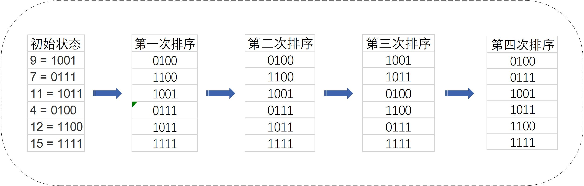
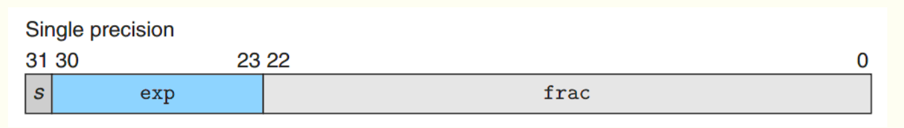
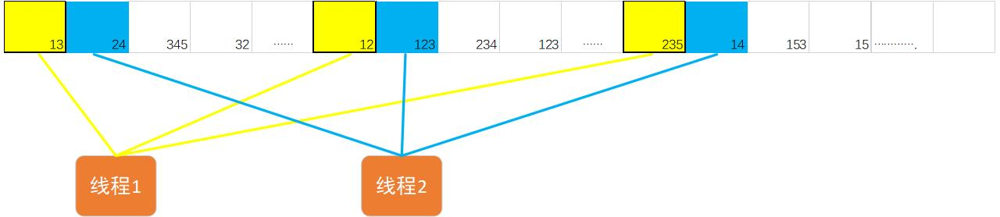
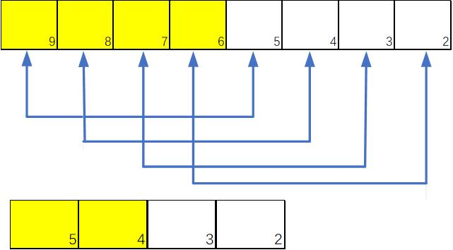

# GPU基数排序(CUDA radix sort)

>**引言**：基数排序是具有固定迭代次数的排序算法,  其通过对最低位到最高位的一一比较，对数值排序。本文将介绍基数排序的并行实现方法，主要包括并行基数排序、并行合并、并行归约这三种算法。

###### 本文全部代码连接： https://github.com/sty16/CUDA_radix_sort 

## 1.基数排序算法

​        基数排序(radix sort)的基本思想是，从最低位开始，按照当前位的数值进行排序得到一个新的序列，对新序列依据高一位的数值重新排序，这样依次循环直到最高位，得到的数列就是一个有序数列，以下面这个例子简单介绍基数排序。

数据集{9, 7,  11 , 4,  12,  15}，其四位的二进制表示为，从低比特位到高比特位的比较过程如图所示


​                                                                          <center>图1 基数排序示意图</center>

## 2. 将基数排序应用于浮点数

对于IEEE 754 其存储形式如下图，最高位表示数字的符号，8位表示指数，23位表示尾数



​                                                                     <center>  图2 IEEE 754标准浮点数存储形式</center>

​       IEEE float有一个特性，除了最高的符号位，从0位到30位对数值的权重依次增加，这些位与32位无符号整数的排序方法相同，针对符号位可做如下的预处理：对于正浮点数，将最高的符号位取反(由0转化为1)。对于负浮点数，全部位取反，这样便可应用整数的基数排序方法(对浮点数应用位运算前需要将其转化为整形), 排序完成后再将其转化。

```
部分代码如下：
unsigned int *data_temp = (unsigned int *)(&src_data[i]);    
*data_temp = (*data_temp >> 31 & 0x1)? ~(*data_temp): (*data_temp) | 0x80000000; 
```

## 3. 并行基数排序方法

​        基数排序每次迭代扫描所有的待排序数据，并根据扫描比特位为0或1将数据分为0列表与1列表，为了简单起见，我使用2N个内存单元，一个用来存放0列表，另外一个存放1列表，接着将1列表置于0列表后，开始下一次迭代。

​        并行化方案，该方法总共有两层for循环，外层的32个比特位循环，内层遍历所有数据的循环。外层的循环不可并行，因为上一迭代的结果为下一迭代的输入。故只能对内层的数据遍历进行并行。为充分利用硬件，假定线程数量为128，让每一个线程对自身对应部分的数据进行基数排序，这样我们得到线程数量个有序的列表。



​                                                                  <center>图3 多线程并行基数排序方法</center>

## 4.并行合并列表

​        经过并行基数排序，我们得到了线程数目(128)个有序列表，对于串行合并方法，我们每次从各有序列表中选取一个最小的数插入到新列表中，因此我们还需要一个数组list_index来记录各个列表当前指针所处的位置。

​        相比于串行合并，并行合并首先通过**并行归约**的方法找到各列表中的最小值。并行归约使用线程数量一半的线程，通过比较当前线程对应元素与另一线程对应元素元素，将较小的值转移到前面的线程中。每次比较后活跃的线程数量减少一半，直到只剩一个线程为止，该线程对应的元素即为最小值。为了方便各线程通信，我们使用了共享内存，通过共享内存我们记录了各线程当前的指针位置与指针所对应的最小值。通过__syncthreads()函数来同步各个线程，最后由线程号为0的线程向新列表中写入最小值。



​                                                                <center>图4 并行规约寻找最小值(黄色为活跃线程)</center>

## 5. 代码说明

代码连接： https://github.com/sty16/CUDA_radix_sort 

>编译方法：
>
>nvcc  radix.cu  -o  radix.exe
```
__device__  radix_sort()           // 并行基数排序
__device__  merge_list()           // 并行合并列表
__device__  preprocess_float()     // 对于浮点数符号位的预处理
__device__  Aeprocess_float()      // 恢复浮点数的符号位
__global__  GPU_radix_sort()       // 基数排序的GPU实现
```
## 6.参考文档：

1. https://www.cnblogs.com/azard/p/3396887.html
2. https://blog.csdn.net/u010445006/article/details/74852690